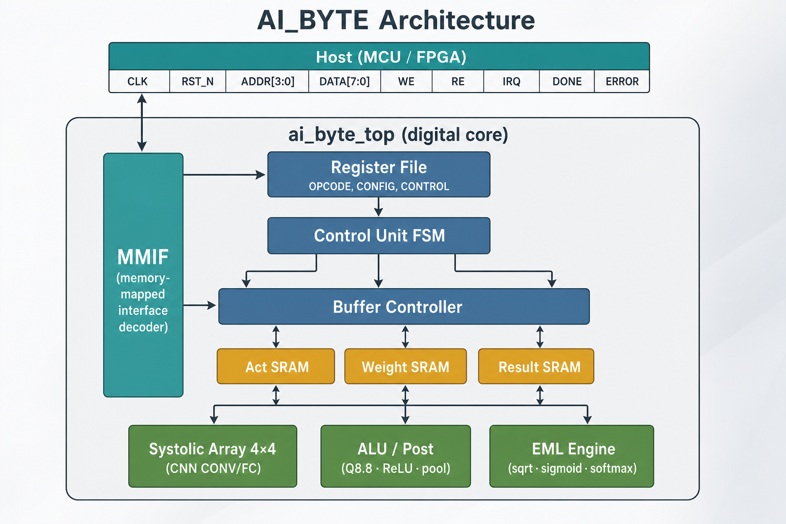

# AI_BYTE — Chipathon 2026 full chip

**AI_BYTE** is a small **edge AI / math accelerator** on GlobalFoundries **180 nm** open PDK (`gf180mcuD`).  
A host microcontrollers or FPGA talks to the chip over a simple **8-bit memory-mapped bus**. Firmware loads data into on-chip SRAMs, programs a register file, pulses **START**, then reads results and status.

This repository is the **chip integration**: digital core RTL, pad adapter, padframe flow, cocotb tests, and LibreLane configs for GDS.

| | |
|--|--|
| Supply | **5 V** single domain (`VDD` / `VSS`) |
| Clock / reset | Single clock domain; active-low `RST_N` |
| Host bus | 4-bit address, 8-bit data, `WE` / `RE`, `IRQ` / `DONE` / `ERROR` |
| Core area estimate | **1100 µm × 1100 µm** (digital core) |
| Typical use | CNN tiles (4×4 SA), FC/CONV, Q8.8 ALU, EML activations |

---

## What the chip provides

### Compute services

| Capability | What you get |
|------------|----------------|
| **CNN tile ops** | Weight-stationary **4×4 systolic array** (INT8 act/weight → INT16 products) for **CONV** and **FC**-style matmul |
| **Post (CNN path)** | Optional **bias**, **ReLU**, **2×2 pooling**, **scale** (INT16 → INT8) selected by CONFIG bits |
| **Fixed-point math** | **ADD / SUB / MUL** on **Q8.8** values in activation / weight / result buffers |
| **Elementary functions (EML)** | **SIGMOID, TANH, RECIP, SQRT, SOFTMAX**, and a small **microcoded / feedback** path (`MICRO`) using Mitchell-style log/exp tiles |
| **On-chip memory** | Three **byte-addressable SRAMs**: Activation, Weight, Result (depths parameterized; default **64 / 16 / 16** bytes) |
| **Host programming model** | 16-register map (`addr[3:0]`), start / soft-reset / IRQ clear, status + interrupt |

### What it is *not*

- Not a general GPU or full CNN SoC — tiles fit **small activations / weights** in the three SRAMs.
- Not IEEE floating point — use **INT8** (CNN) or **Q8.8** (ALU / EML) as agreed per opcode.
- EML is **approximate** (Mitchell expansion); software must budget error (tests use tolerances).
- Debug observability pins may exist in RTL/pads; they are **optional**, not part of the minimum host contract.

---

## How the chip works (inside)



*Figure: Host MMIF → register file / control → buffer controller + SRAMs → systolic array, ALU/post, and EML engines.*

1. **MMIF** — maps host `addr` / `data` / `we` / `re` to either the **register file** or the **buffer data window** (`addr == 0x6`).
2. **Register file** — holds opcode, CONFIG flags, tensor sizes (where needed), buffer pointer, and **CONTROL** pulses (start / soft-reset / IRQ clear). Broadcasts config to the rest of the control path.
3. **Control unit** — FSM that, after **START**, sequences one **opcode**: move data through the buffer controller into the right engine, wait for completion, set **STATUS** / **IRQ**.
4. **Buffer controller** — owns all SRAM traffic (host CPU mode vs compute mode); packs/unpacks bytes to engine word widths when needed.
5. **Compute engines** (treated as IPs from control’s point of view):
   - **SA** for CONV/FC tiles  
   - **Post / ALU** for integer / Q8.8 / CNN cleanup  
   - **EML** for nonlinear math  

**Two host modes:**

| Mode | Behavior |
|------|----------|
| **CPU buffer mode** (no START) | FSM idle. Host sets `BUFFER_SELECT` + `BUFFER_ADDR`, then reads/writes **BUFFER_DATA** (`0x6`) to fill Act / Weight or dump Result. |
| **Compute mode** | Host programs opcode + CONFIG + sizes as needed, then writes **CONTROL.START**. Engines run; host waits on **IRQ** / **DONE**, checks **STATUS**, optionally clears IRQ, then reads Result via BUFFER_DATA. |

Single clock domain; `RST_N` is asynchronous active-low hard reset. CONTROL soft-reset is a one-cycle soft clear path for control logic.

### Data formats (short)

| Path | In buffers | Engine view |
|------|------------|-------------|
| Physical SRAM / MMIF | Always **8-bit** beats | — |
| CNN (SA) | INT8 activations & weights | INT16 row products; often **scaled to INT8** in Result if `scale_en` |
| ALU math | Two bytes = **Q8.8** little-endian | Q8.8 add/sub/mul |
| EML | Q8.8 words (or INT8 promoted then optional re-scale) | Approximate transcendental results |

Q8.8 layout: `buf[2*i] = low byte`, `buf[2*i+1] = high byte`.

### Register map (host `addr[3:0]`)

| Addr | Name | Role |
|------|------|------|
| `0x0` | CONTROL | W: bit0 **START**, bit1 soft-reset, bit2 **IRQ clear**. Reads 0. |
| `0x1` | STATUS | R: busy / done / error (see STATUS bits in tests/golden) |
| `0x2` | OPCODE | W/R: operation code (4 bits used) |
| `0x3` | CONFIG | W/R: feature flags for post / EML scale (6 bits) |
| `0x4` | BUFFER_SELECT | Which SRAM: Act=`0`, Weight=`1`, Result=`2` |
| `0x5` | BUFFER_ADDR | Byte address into that buffer |
| `0x6` | BUFFER_DATA | Host R/W window into selected SRAM (not RF storage) |
| `0x7`–`0xA` | feature rows/cols, Cin / Cout | Shape knobs for CNN-style ops |
| `0xB` | SOFTMAX_N | Vector length for softmax |
| `0xF` | VERSION | ID (`0x02` in current RF) |

### Opcodes (subset used in e2e)

| Code | Mnemonic | Notes |
|------|----------|--------|
| `0x0` | CONV | SA + optional ReLU / pool / scale |
| `0x1` | FC | SA + optional bias / ReLU / scale |
| `0x2` / `0x3` / `0x4` | ADD / SUB / MUL | Q8.8 |
| `0x6`–`0x9` | SIGMOID / TANH / RECIP / SQRT | EML |
| `0xA` | SOFTMAX | EML serial path; needs `SOFTMAX_N` |
| `0xB` | MICRO | Micro / feedback EML path |

CONFIG bits (typical): ReLU, pool, pool type, bias_en, scale_en, eml_scale_en — see `reg_file.v` and golden model.

---

## Assumptions and limitations

Treat these as **design contracts** for software and board:

1. **5 V I/O and core** — Host interface and DVDD rails expect **5 V CMOS**, not 3.3 V.
2. **Single clock domain** — No multi-clock CDC; keep `CLK` within the STA period you sign off (core LibreLane default is **100 ns / 10 MHz**; 25 MHz has been shown *not* to close easily).
3. **Small tiles only** — SA is **4×4**; buffer depths are tiny (defaults 64/16/16 bytes). Large tensors require **host tiling** and multiple jobs.
4. **One job at a time** — START is accepted when not busy; no out-of-order queue.
5. **Data packing is software responsibility** — Little-endian Q8.8 pairs, INT8 layouts for CNN tiles, CONFIG alignment with the opcode path.
6. **EML is approximate** — Do not expect bit-exact match to `libm`; use tolerance or calibration.
7. **IRQ / DONE / ERROR** — Completion is by status + IRQ; always clear sticky IRQ when done. Illegal opcodes raise error paths rather than silent success.
8. **Padframe may expose more pins** than the functional set (unused analog pads, multi-copy power pads). Functional **minimum** for AI_BYTE is listed below; extra pads depend on the package slot, not on the accelerator logic.
9. **Active-low reset** — Assert `RST_N` low at power-up until clocks are stable.

---

## How to use the chip (host)

### Electrical

| Net | Role |
|-----|------|
| `VDD` | 5 V power (one rail; all VDD pads tied together) |
| `VSS` | Ground (all ground pads tied together) |
| `CLK` | Continuous system clock |
| `RST_N` | Hard reset, active low |
| `ADDR[3:0]`, `WE`, `RE` | Drive from host |
| `DATA[7:0]` | Bidirectional — host drives only when **not** doing a read (`re && !we` is when the chip may drive) |
| `IRQ` | Chip → host status |
| `DEBUG_STATE[2:0]` | Optional FSM observability |

**Minimum pin budget (functional):**

```text
Area estimate: 1100 um x 1100 um (digital core; padframe die depends on slot)
Required pins: Power 1, Ground 1 (own pad; quiet ground first), Digital 17, Analog 0
```

= `VSS` (quiet ground, listed first in `info.yaml`), `VDD`, then `CLK`, `RST_N`, `ADDR[3:0]`, `WE`, `RE`, `DATA[7:0]`, `IRQ`. Optional: `DEBUG_STATE[2:0]`. `DONE`/`ERROR` are in the STATUS register (CPU-readable), not package pins. Each power pad must be paired with a ground pad (no shared padframe ground).

CSV tables: [`docs/AI_BYTE_pinout_sheet.csv`](docs/AI_BYTE_pinout_sheet.csv).

### Typical software flow

```text
1. Power up, hold RST_N low, start CLK, release RST_N
2. (Optional) write CONTROL soft-reset / IRQ clear
3. Fill Activation (and Weight if needed):
      write BUFFER_SELECT, BUFFER_ADDR once
      write BUFFER_DATA for each byte (addr may auto-increment on access paths)
4. Write OPCODE, CONFIG, and size regs as required by that op
5. Write CONTROL = START (bit0)
6. Wait until IRQ; read STATUS (check done/error bits)
7. Write CONTROL = IRQ clear if needed
8. Read results: BUFFER_SELECT = Result, walk BUFFER_ADDR / BUFFER_DATA
9. Next job…
```

Pseudo-sequence for a Q8.8 ADD (conceptually):

```text
// pack floats to Q8.8 little-endian into Act/Wt as required by opcode
write_reg(OPCODE, OP_ADD)
write_reg(CONFIG, 0)           // path-dependent
// load buffers via BUFFER_SELECT / ADDR / DATA
write_reg(CONTROL, 0x01)      // START
wait_for_irq()
status = read_reg(STATUS)
// read Result bytes, unpack Q8.8
write_reg(CONTROL, 0x04)      // clear IRQ
```

Reference implementation of these sequences:  
`cocotb/test_ai_byte.py`, helpers in `cocotb/ai_byte_pads.py`, architectural golden in `cocotb/golden/`.  
**Verification plan (how the chip is tested + golden co-sim):** [`cocotb/README.md`](cocotb/README.md).

---

## Building and simulating this repo

### Layout

```text
src/chip_top.sv       padframe top (if used)
src/chip_core.sv      pad adapter → AI_BYTE MMIF pins
src/ai_byte/          digital design (control, buffers, SA, EML, post, interface)
cocotb/               pad-level tests + golden model
librelane/            full-chip and core-only PnR configs
docs/                 extra notes and pin CSVs
Makefile              sim, clone-pdk, librelane, librelane-core
```

### Simulate (RTL, pad-level e2e)

```bash
nix-shell              # recommended tool environment
make sim               # smoke + AI_BYTE opcode suite (default slot as configured)
COCOTB_TEST_MODULES=test_ai_byte make sim
```

Needs cocotb + a Verilog simulator. PDK not required for pure RTL cocotb.  
Pass log for reviewers: **`cocotb/results.xml`** (copied from `sim_build/` after `make sim`; `sim_build/` stays gitignored).

### Place & route

Uses PDK `gf180mcuD` and stdcell **`gf180mcu_fd_sc_mcu7t5v0`**.  
**Crispi-style:** harden the core, then place it as a macro in the workshop padring.

```bash
make clone-pdk && make check-pdk

# Step A — digital core macro (no pads)
make librelane-core-nodrc
# make librelane-core

# Step B — workshop padframe + hardened ai_byte_top macro
SLOT=workshop make librelane
# SLOT=workshop make librelane-nodrc
```

Confirm SCL: `make help` prints `STD_CELL_LIBRARY=gf180mcu_fd_sc_mcu7t5v0`.  
Details: [`librelane/README.md`](librelane/README.md).

Outputs: `final_core/` (macro) then `final/gds/chip_top.gds` (submission).

### A02 user macro (Chipathon tapeout block)

D10-style **1110×1110 µm** block per organizer `A02_A.def` (Metal2 abutment, power connectors, no on-die pad ring):

```bash
make clone-pdk && make check-pdk
make librelane-a02-macro          # full signoff → final_a02_macro/
# make librelane-a02-macro-nodrc  # skip DRC while iterating
```

Signoff bundle and reports: [`docs/signoff_a02_macro/README.md`](docs/signoff_a02_macro/README.md).

**Chipathon submission paths** (`info.yaml` + `lvs_config.json` on `main`):

| Path | Role |
|------|------|
| `gds/A02_A.gds` | Layout (`TOP_SOURCE` = `A02_A`) |
| `verilog/gl/A02_A.v` | Gate-level netlist for LVS |
| `info.yaml` | 146 Metal2 abutment pins (organizer `A02_A.def` order) |
| `docs/signoff_a02_macro/` | DRC/LVS/STA reports + `metrics.csv` / `metrics.json` |

### Resync RTL from parent monorepo (optional)

If you develop control/CE elsewhere:

```bash
./scripts/sync_ai_byte.sh
```

More integration notes: [`docs/AI_BYTE.md`](docs/AI_BYTE.md).

---

## Credits and license

Padframe template and LibreLane packaging build on wafer-space **gf180mcu-project-template**; workshop-style pad geometry roots in Juan Moya’s workshop padring.  
See [`CREDITS.md`](CREDITS.md), [`NOTICE`](NOTICE), [`AUTHORS.md`](AUTHORS.md).

**License:** Apache-2.0 — [`LICENSE`](LICENSE).
