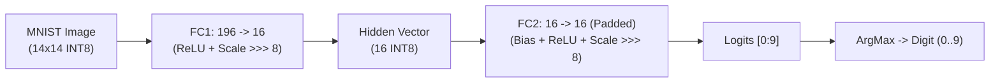

# AI_BYTE Quantized CNN Inference on MNIST

This directory contains a complete, cycle-accurate implementation of a quantized Convolutional / Fully-Connected Neural Network for **MNIST handwritten digit classification** running on the **AI_BYTE** hardware accelerator ASIC (`chip_top`).

---

## 1. Architecture & Hardware Mapping

The **AI_BYTE** accelerator features:
- **$4 \times 4$ Weight-Stationary Systolic Array**: Computes $4 \times 4$ Matrix Multiplication (INT8 inputs $\to$ INT16 accumulators).
- **Embedded SRAM**:
  - `Activation SRAM` (64 bytes: `0x00..0x3F`): Holds input activations and optional biases.
  - `Weight SRAM` (16 bytes: `0x00..0x0F`): Holds stationary weights.
  - `Result SRAM` (16 bytes: `0x00..0x0F`): Stores post-processed output tiles.
- **Configurable Post-Processor**:
  - Optional INT8 Bias addition (`CFG_BIAS = 0x01`).
  - Optional ReLU activation (`CFG_RELU = 0x02`).
  - Optional $2 \times 2$ Max-Pooling (`CFG_POOL = 0x04`).
  - Fixed scaling requantization (`CFG_SCALE = 0x08`): Arithmetic right-shift by 8 bits with signed INT8 clamping to $[-128, 127]$.

### Network Topology



1. **Pre-processing**:
   - Standard $28 \times 28$ MNIST digits downsampled to $14 \times 14$ via $2 \times 2$ average pooling.
   - Pixels quantized to signed INT8 in range $[-64, 63]$.
2. **Hidden Layer (FC1)**:
   - Input: $196$ features.
   - Weights: $196 \times 16$ INT8 matrix.
   - Tiling: Broken into $49 \times 4 = 196$ hardware tiles of size $4 \times 4$ on the systolic array.
   - Activation: ReLU + Scale (`>>> 8`) produces $16$ INT8 activations.
3. **Classification Layer (FC2)**:
   - Input: $16$ hidden activations.
   - Weights: $16 \times 16$ INT8 matrix (10 digit classes padded with zeros to 16).
   - Biases: 16 INT8 biases loaded into `Activation SRAM` offset `0x10..0x1F`.
   - Post-processor: Bias addition + Scale (`>>> 8`).
   - Output: 10 logits $\to$ ArgMax yields final predicted digit.
4. **Convolution Tile Test (OP_CONV)**:
   - Tests $4 \times 4$ edge-detection kernel on image patches with $2 \times 2$ max-pooling down to $2 \times 2$ (4 output bytes).

---

## 2. Accuracy & Verification Results

| Evaluation Level | Environment | Samples | Accuracy | Notes |
| :--- | :--- | :--- | :--- | :--- |
| **Full Test Set** | NumPy Bit-Exact INT8 | 10,000 | **93.77%** | Matches bit-exact hardware ALU & scaling (`>>> 8`) |
| **Golden Co-Sim** | `AiByteGolden` | 50 | **96.0%** | Full MMIF register & SRAM simulation |
| **RTL Simulation** | Cocotb + Icarus Verilog (`chip_top`) | 5 | **100.0%** | Cycle-accurate pin-level test with GF180MCU SRAM macros |

In RTL simulation, `test_mnist_classification` verifies that the hardware output logits match the software golden model **bit-for-bit** across all layers and cycles.

---

## 3. Directory Layout

```
cnn_test_flow/
├── cnn_driver.py         # Hardware tiling driver (supports GoldenBackend and CocotbBackend)
├── mnist_loader.py       # Dataset downloader, 14x14 downsampler, INT8 preprocessor
├── model.py              # Model training, bit-exact INT8 quantization, weight exporter
├── test_cnn_mnist.py     # Cocotb RTL testbench (OP_CONV, OP_FC, end-to-end classification)
├── run_mnist_test.sh     # Executable runner script for Docker and local simulation
├── data/                 # Cached quantized MNIST test set (npz)
├── weights/              # Trained quantized model weights and JSON spec
└── README.md             # This documentation
```

---

## 4. How to Run

### Prerequisite: PDK Setup
Ensure the GF180MCU PDK is cloned (only needs to be run once):
```bash
make clone-pdk
```

### Option A: Using the Automated Runner Script
The included script [`run_mnist_test.sh`](run_mnist_test.sh) handles Docker mounting, PDK paths, and execution:

```bash
# Run both Golden co-sim and RTL Cocotb test:
./cnn_test_flow/run_mnist_test.sh --all

# Run only fast Golden co-sim:
./cnn_test_flow/run_mnist_test.sh --golden

# Run only cycle-accurate RTL test in Docker:
./cnn_test_flow/run_mnist_test.sh --rtl
```

### Option B: Direct Docker Commands

**Run RTL Cocotb Test Suite:**
```bash
docker run --rm \
  -v "$(pwd):/workspace" \
  -v "${HOME}/.cache:${HOME}/.cache" \
  -w /workspace \
  -e PDK_ROOT="${HOME}/.cache/ai-byte/pdk/gf180mcu" \
  -e PDK=gf180mcuD \
  hpretl/iic-osic-tools:latest -s bash -c \
  "PYTHONPATH=/workspace:/workspace/cocotb PDK_ROOT=${HOME}/.cache/ai-byte/pdk/gf180mcu PDK=gf180mcuD COCOTB_TEST_MODULES=cnn_test_flow.test_cnn_mnist python3 cocotb/chip_top_tb.py"
```

**Retrain or Requantize Model:**
```bash
docker run --rm -v "$(pwd):/workspace" -w /workspace \
  hpretl/iic-osic-tools:latest -s bash -c \
  "python3 -m cnn_test_flow.model"
```

